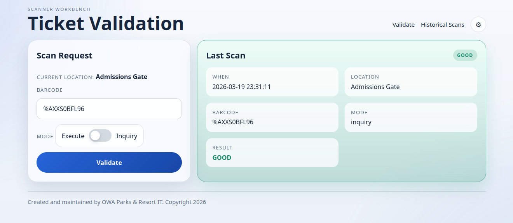

# Ticket Validation App

Minimal Flask app for an internal ticket validation workflow.



## Features

- Current-location setting stored in a signed session cookie
- Ticket validation form with `execute` and `inquiry` modes
- Result display for the most recent scan
- SQLite-backed scan history
- Admin location management with archive and restore support

## Run with Docker

Gunicorn runs inside the same app container. SQLite is stored on a Docker volume mounted at `./data`.

1. Update `.env` for the target environment.
2. For live testing, set `SCANNER_TESTING=false` and provide `SCANNER_API_URL`.
3. Copy `docker-compose.yml`
3. Build and start the container:

```bash
docker compose up
```

The app will be available at `http://localhost:8000`. Or whatever you changed the port to in the compose file.

## Environment variables

- `FLASK_SECRET_KEY`: Flask session secret
- `DATABASE_URL`: Optional SQLAlchemy database URI override. Docker Compose sets this to `sqlite:////data/scanner.db`
- `SCANNER_API_URL`: Endpoint used for the validation call
- `SCANNER_API_TIMEOUT`: Request timeout in seconds. Defaults to `10`
- `SCANNER_TESTING`: When `true`, disables live API calls and shows a Good/Bad test toggle in the UI

## Dev - Run locally

```bash
cp .env.example .env
python3 -m venv .venv
source .venv/bin/activate
pip install -r requirements.txt
flask --app run.py --debug run
```

## Notes

- The main app is intentionally open. Admin routes are also open in this scaffold and should be protected once authentication is added.
- The app seeds one default location on first boot: `Main Warehouse / WHSE-001`.
- The app uses SQLite by default and creates `scanner.db` automatically. `DATABASE_URL` is still supported if you want to override the database connection.
- Database setup currently uses `db.create_all()` for simplicity. Move to migrations before shared deployment.
- The SOAP request currently sends `scan`, `inquiry`, and `location`, where `location` is the current selected location number from the app settings.
- The Docker setup uses a single app container with Gunicorn and a persistent SQLite volume. That is the intended initial deployment model for small standalone client installs.
